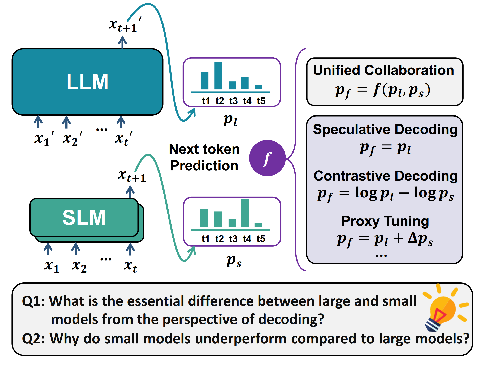

# FS-GEN
## Abstract
Large Language Models (LLMs) demonstrate impressive performance in diverse applications, yet they face significant drawbacks, including high inference latency, expensive training cost, and generation of hallucination. Collaborative decoding between large and small language models (SLMs) offers a novel approach to address these challenges. Inspired by dual-process cognitive theory, we integrate these methods into a unified framework termed Fast and Slow Generating (FS-GEN). This paper explores several techniques within the FS-GEN framework, including speculative decoding, contrastive decoding, and emulator or proxy fine-tuning. We provide a comprehensive analysis of these methodologies, offering insights into their similarities and differences under this framework. Our study delves into the differential knowledge capabilities of LLMs versus SLMs through the FS-GEN lens, revealing that fewer than 20\% of collaborative interactions are required across various methods. These interactions adhere to a scaling law relative to the parameter ratios, thereby facilitating predictable collaboration. Furthermore, we investigate the specific positions where collaboration is most effective from an uncertainty perspective, yielding novel insights that could refine FS-GEN methods. Our findings reveal that the essential difference between models of different sizes lies in the uncertainty of the next token prediction, where interventions by larger models are most needed to assist the smaller ones.


<div align="center">
    <a href="./">
        
    </a>
</div>


## Setup
```shell
conda create --name <env> --file ./requirements.txt
```

## Usage

### Dump and evaluate
If you want to individually test a combination of models under a particular dataset, use the following command
```shell
python logits_gen.py --router router --method method --sampling sampling --dataset dataset --large-model-path large_model_path --small-model-path small_model_path --small-ft-model-path None
```

If you want to perform tests with different co-methods and routers, use the following command

```shell
chmod +x logits_gen.sh
./logits_gen.sh
```
You should set router and co-methods first, then run the test script. Results will be saved in ```outputs_logits```.


### Visualize
You can draw test images directly through running the code in the folder ```visualize```
```shell
python visualize_codes.py
```
Note that you should run dump and evaluate first to ensure the folder ```outputs_logits``` is not empty.


### Citation
```
@misc{zhang2024fast,
      title={Fast and Slow Generating: An Empirical Study on Large and Small Language Models Collaborative Decoding}, 
      author={Kaiyan Zhang and Jianyu Wang and Ning Ding and Biqing Qi and Ermo Hua and Xingtai Lv and Bowen Zhou},
      year={2024},
      eprint={2406.12295}
}
```